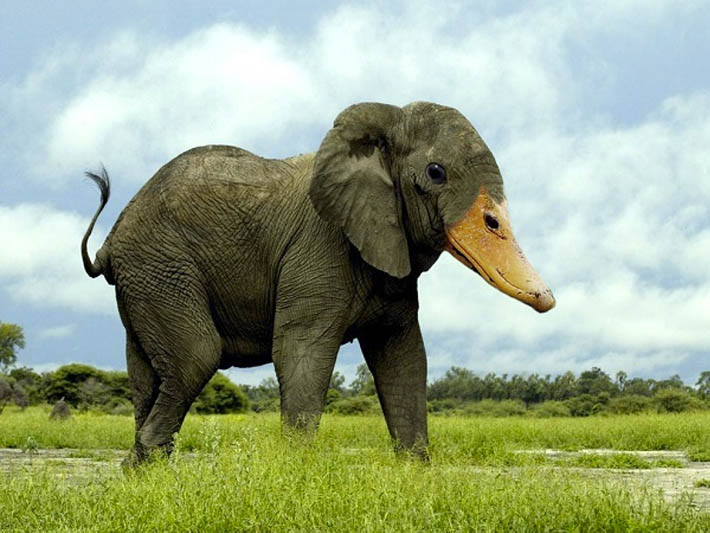

# Anomaly Localization with Score-Based Diffusion Models
<p align="middle">
    
    
</p>

## Introduction

This project aims to add anomaly detection capabilities to score-based diffusion models, enabling the detection of anomalies in natural images. The core idea is to learn the distribution of typical score vectors for each patch position in an image. By training a position-conditioned normalizing flow model, we can estimate the likelihood of the score vectors' outputs. This allows for visualizing per-patch likelihoods and generating heatmaps of anomalies.

## Background

The methodology for this project is based on research conducted as part of my doctoral dissertation. The underlying concepts are detailed in the following paper: [Multiscale Score Matching for Out-of-Distribution Detection](https://arxiv.org/abs/2010.13132).

This code builds upon the excellent [EDM2 repository](https://github.com/NVlabs/edm2) by NVLabs. For more information on the diffusion models, please refer to the original work.

## Features

- **Anomaly Detection**: Identify and localize anomalies in natural images.
- **Score-Based Diffusion Models**: Utilizes state-of-the-art (non-latent) diffusion models.
- **Heatmap Visualization**: Generate heatmaps to visualize anomaly likelihoods.

## Installation

You can run the gradio app locally. To get started, clone the project and install the dependencies.

```bash
   git clone https://github.com/ahsanMah/localizing-anomalies.git
   cd localizing-anomalies
   pip install -r requirements.txt
```

The model will work without a GPU but may take 15-30 seconds given your resources. If you have a NVIDIA GPU, install PyTorch with CUDA.

## Usage
```bash
python app.py
```
Then go to [http://localhost:7860](localhost:7860)


### Notes
- As the underlying models are trained on Imagenet-1k, you may have better success when the subject belongs to one of the 1000 classes it was trianed on 
- It helps to have the subject centered in the middle of the image. This is due to the resize-center-crop that was used to train the score models


### Acknowledgements

Special thanks to NVLabs for their [EDM2 repository](https://github.com/NVlabs/edm2).